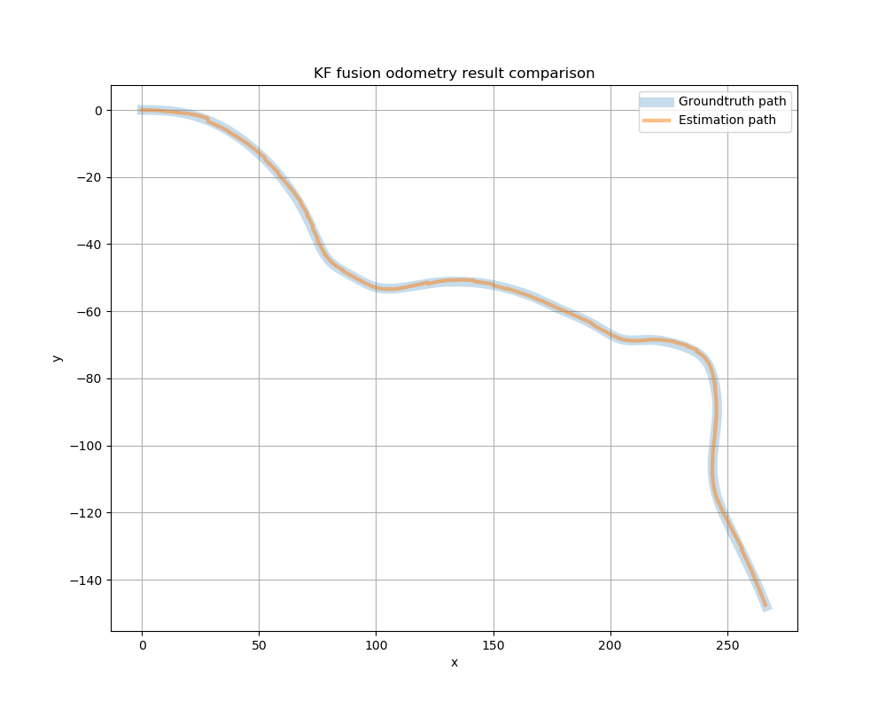

# Application of EKF

## Part 1 : Setup
### Enviroment Setup

Please refer to [Enviroment Setup](https://hackmd.io/iEpGB4jXRIqkL8kOykUC3A#Enviroment-Setup)

## Part 2 : Application of EKF
### Introduction
In the localization task, **Extended Kalman filter** is a tool to fuse information from different sensors. In this project, we use **radar odometry** and **GPS** with covariance. Radar odometry provides position and heading overtime, which is obtained from radar sensor. GPS provides position overtime. Noted that the frequency of sensors are different.

### Objective
Your task is to create a customized motion model and observation matrix in the Extended Kalman Filter to fuse data from radar odometry and GPS. Then use rviz to visualize the results. You can modify the template files provided in the package to complete the project.

### Data
* A rosbag from NuScenes Dataset
* Topic 
  - /clock-------------------(rosgraph_msg/Clock)
  - /gps---------------------(geometry_msg/PoseWithCovarinceStamped)------Simulated GPS(~1Hz)
  - /gt_odom-------------(nav_msgs/Odometry)-------------------------------------Ground truth odometry
  - /imu---------------------(sensor_msgs/Imu)------------------------------------------------------------------------IMU
  - /nuscenes_lidar-----(sensor_msgs/PointCloud2)---------------------------------------Lidar pointcloud
  - /radar_odometry---(nav_msgs/Odometry)--------------------------Odometry calculated by radar
  - /tf-------------------------(tf2_msgs/TFMessage)-------------Transformations between coordinates

**/radar_odometry** is the **local measurement** which have accumulated error
**/gps** is the **global measurement** which only provides x, y position
**/gt_odom** is the ground truth, can only be used to verify your result

### Package
Please download template files and data from the [**link**](https://github.com/pithreeone/fusion/tree/student)
The directory structure in container should be as follow : 
```
~/catkin_ws
├── src/fusion
│   ├── launch/EKF_fusion.launch
│   ├── rviz_config/rviz_config.rviz
│   ├── src
│   │   ├── fusion.py (To be done)
│   │   ├── EKF.py (To be done)
│   ├── CMakeLists.txt
│   ├── package.xml
|   ├── data/data.bag
```
`fusion.py` and `kalman_filter.py` are provided as template files for your work. The question marks in the files serve as hints, offering guidance on potential modifications.

To run the code:
1. Enter the docker container
2. In terminal `cd ~/catkin_ws`
3. `roslaunch fusion EKF_fusion.launch `
4. press space to run the bag
5. After the bag finish playing, force quit the first terminal program, the result will show up and save in `~/catkin_ws/src/fusion/result/result.png`

### Result


### Discussion
1. How do you design the EKF (motion model, observation matrix, states, etc.)?
2. What is the covariance matrix of **GPS**, **radar odometry** and what does it mean?

---
### Useful command
* To visualize : `rviz`
* rosbag : https://wiki.ros.org/rosbag/Commandline
* roslaunch : https://wiki.ros.org/roslaunch
* rostopic : https://wiki.ros.org/rostopic
* ROS odometry msg structure : http://docs.ros.org/en/noetic/api/nav_msgs/html/msg/Odometry.html
* ROS pose msg structure : http://docs.ros.org/en/noetic/api/geometry_msgs/html/msg/Pose.html


